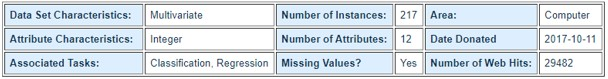

# MoviePayOffPrediction

## Dataset Description:    
   
 
 #### Attributes:  
-	Movie: Movie’s name.  
-	Year: The year of the movie released  
-	Ratings: Movie’s IMDB rating(X/10)  
-	Genre: Genre of the movie (Already encoded in the dataset)  
-	Gross: Total money earned from the movie  
-	Budget: Total money spent fort he movie.  
-	Screens: The number of screens (movie theater) in which the movie was released.  
-	Sequel: If the movie is a series; the order of the movie. If not the ‘Sequel’ = 1.  
-	Sentiment: Sentiment analysis of the movie which is obtained by social media.  
-	Views: How many people watced the movie.  
-	Likes: Number of likes (obtained by social media).  
-	Dislikes: Number of dislikes (obtained by social media).  
-	Comments: Number of comments (obtained by social media).  
-	Aggregate Followers: Total number of followers (obtained by social media).  
                             (Dataset includes the movies which are released in 2014-2015)  
#### Dataset URL:  
https://archive.ics.uci.edu/ml/datasets/CSM+%28Conventional+and+Social+Media+Movies%29+Dataset+2014+and+2015

## Aim Of The Project:
I created a new attribute named ‘IsPayOffWithOnlyTicket’ and this means; If the movie gain more than its budget with only the money which gained with the movie tickets. (Total movie gain is not just ticket gain). If yes I labeled it as 1 and if not I labeled it as 0.  
The main task of this project is: try to classify the movies according to whether they are PayOffWithOnlyTicket or not with using the attributes : { Ratings, Budget, Screens, Sentiment, Views, Like-Dislike, Comments, TotalFollowers }.   
The side task of this project is; try and compare various classification techniques.   
Comparison of the classification techniques made by confussion matrix results.  

## Used Technologies:
 Pandas, Numpy, MatplotLib, Seaborn
